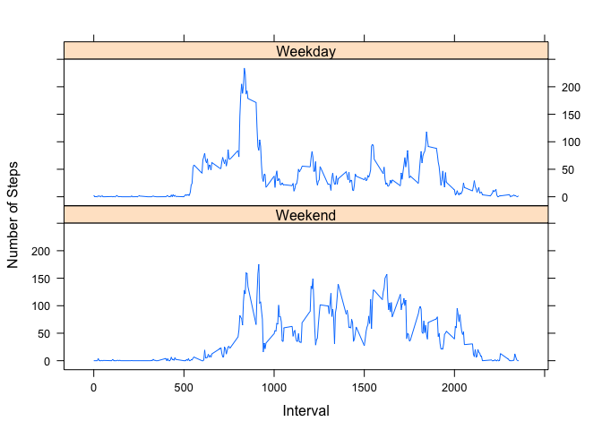

## Loading and preprocessing the data


```r
data = read.csv(file = "activity.csv")
data$date = as.Date(data$date,"%Y-%m-%d")
```

## What is mean total number of steps taken per day?

1. Calculate the total number of steps taken per day


```r
steps_day = aggregate(steps~date,data,sum,na.rm=TRUE)
head(steps_day)
```

```
##         date steps
## 1 2012-10-02   126
## 2 2012-10-03 11352
## 3 2012-10-04 12116
## 4 2012-10-05 13294
## 5 2012-10-06 15420
## 6 2012-10-07 11015
```

2. If you do not understand the difference between a histogram and a barplot, research the difference between them. Make a histogram of the total number of steps taken each day


```r
hist(steps_day$steps,breaks=length(steps_day$steps),main="Histogram of the total steps taken each day",xlab="Steps")
```

<!-- -->

3. Calculate and report the mean and median of the total number of steps taken per day


```r
mean(steps_day$steps)
```

```
## [1] 10766.19
```

```r
median(steps_day$steps)
```

```
## [1] 10765
```

## What is the average daily activity pattern?

1. Make a time series plot (i.e. type="l") of the 5-minute interval (x-axis) and the average number of steps taken, averaged across all days (y-axis)


```r
steps_interval = aggregate(steps~interval,data,mean,na.rm=TRUE)
plot(steps_interval$interval,steps_interval$steps,type="l",main="Average number of steps taken for each 5-minutes interval",xlab="5-min interval",ylab="Steps")
```

<!-- -->

2. Which 5-minute interval, on average across all the days in the dataset, contains the maximum number of steps?


```r
max(steps_interval$steps)
```

```
## [1] 206.1698
```

## Imputing missing values

1. Calculate and report the total number of missing values in the dataset (i.e. the total number of rows with NAs)


```r
sum(is.na(data$steps))
```

```
## [1] 2304
```

2. Devise a strategy for filling in all of the missing values in the dataset. The strategy does not need to be sophisticated. For example, you could use the mean/median for that day, or the mean for that 5-minute interval, etc. Create a new dataset that is equal to the original dataset but with the missing data filled in.


```r
na_indexes = which(is.na(data$steps))
data_filled = data
for(i in na_indexes){
        data_filled$steps[i] = steps_interval$steps[steps_interval$interval==data$interval[i]]
}
```

3. Make a histogram of the total number of steps taken each day and Calculate and report the mean and median total number of steps taken per day. Do these values differ from the estimates from the first part of the assignment? What is the impact of imputing missing data on the estimates of the total daily number of steps?


```r
steps_day_filled = aggregate(steps~date,data_filled,sum,na.rm=TRUE)
hist(steps_day_filled$steps,breaks=length(steps_day_filled$steps),main="Histogram of the total steps taken each day with the filled dataset",xlab="Steps")
```

<!-- -->


```r
mean(steps_day_filled$steps)
```

```
## [1] 10766.19
```


```r
median(steps_day_filled$steps)
```

```
## [1] 10766.19
```

There are no changes between the original data and the filled data. After analysis here are the days with NA values : 


```r
days_with_na = unique(data$date[is.na(data$steps)])
print(days_with_na)
```

```
## [1] "2012-10-01" "2012-10-08" "2012-11-01" "2012-11-04" "2012-11-09"
## [6] "2012-11-10" "2012-11-14" "2012-11-30"
```

If we look closer at how many intervals are filled with NAs for these days, we notice that they are fully empty (288 intervals for one day)


```r
for(i in days_with_na){
        print(length(data$date[data$date==i&is.na(data$steps)]))
}
```

```
## [1] 288
## [1] 288
## [1] 288
## [1] 288
## [1] 288
## [1] 288
## [1] 288
## [1] 288
```

Therefore, filling the NA's just meant adding days that are means of the other days. That is why neither the mean has changed nor the general shape of the histogram.

## Are there differences in activity patterns between weekdays and weekends?

1. Create a new factor variable in the dataset with two levels – “weekday” and “weekend” indicating whether a given date is a weekday or weekend day.


```r
library(chron)
week_day_end = factor(is.weekend(data$date),levels=c(TRUE,FALSE),labels=c('Weekend','Weekday'))
```

2. Make a panel plot containing a time series plot (i.e. type="l") of the 5-minute interval (x-axis) and the average number of steps taken, averaged across all weekday days or weekend days (y-axis). See the README file in the GitHub repository to see an example of what this plot should look like using simulated data.


```r
library(lattice)
data_week = data
data_week[["weekdayend"]]=week_day_end
aggregated_data = aggregate(steps~interval+weekdayend,data_week,mean)

with(aggregated_data,xyplot(steps~interval|weekdayend,xlab='Interval',ylab='Number of Steps',type="l",layout=c(1,2)))
```

<!-- -->
